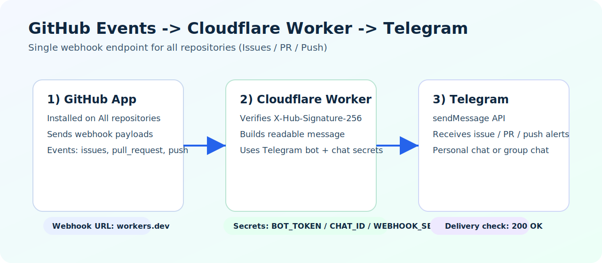
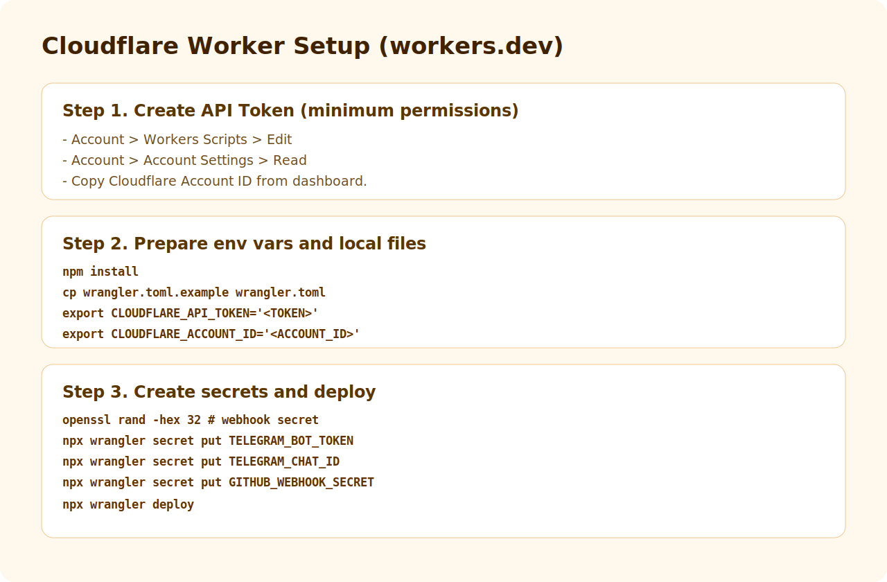
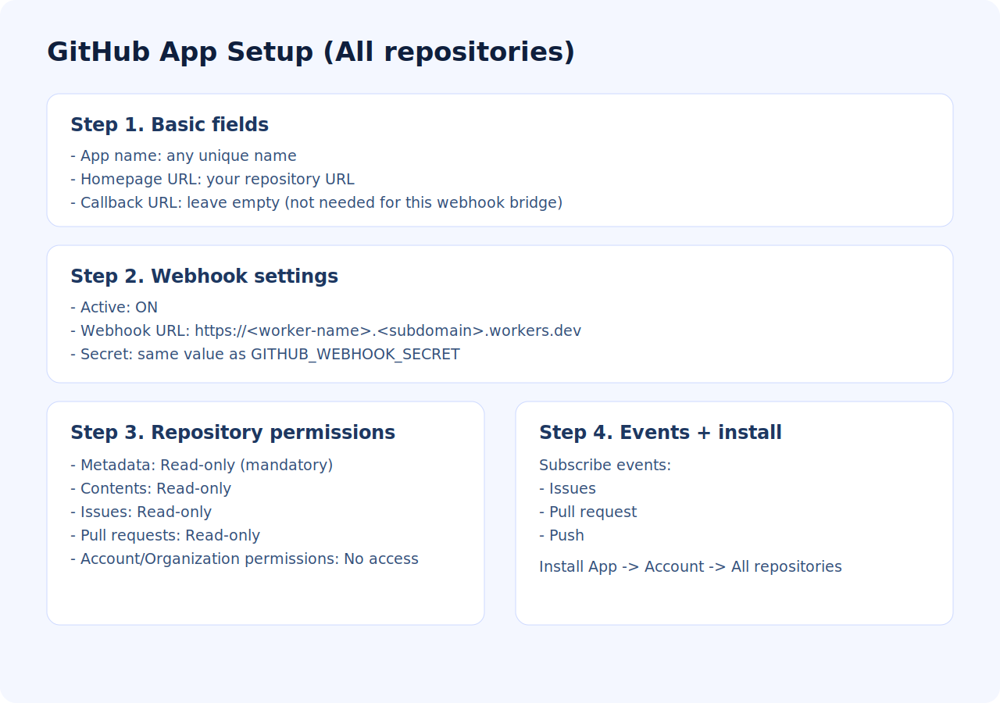
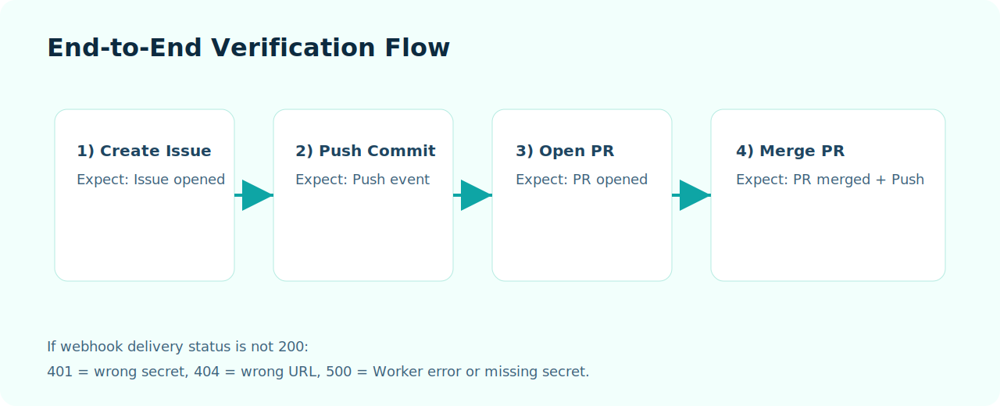

# GithubTelegramNotifier

[한국어](./README.md) | [English](./README.en.md)

A webhook bridge that receives GitHub App events from all repositories and sends notifications to Telegram.



## What You Get
- One webhook endpoint for all repositories
- Notifications for `issues`, `pull_request`, and `push`
- Signature verification (`X-Hub-Signature-256`)
- Deployable on Cloudflare Workers (`workers.dev`)

## Prerequisites
- Cloudflare account
- GitHub account
- Telegram account
- Node.js + npm
- `jq` for easy JSON parsing (recommended)

## 1) Telegram Setup (Bot Token + Chat ID)


### 1-1. Create a bot
1. Open Telegram and search for `@BotFather`.
2. Run `/newbot`.
3. Copy your bot token.

### 1-2. Get chat_id
1. Send at least one message to your bot (or your target group).
2. Run:

```bash
TOKEN='<YOUR_TELEGRAM_BOT_TOKEN>'
curl -s "https://api.telegram.org/bot${TOKEN}/getUpdates" \
| jq -r '.result[-1].message.chat.id // .result[-1].my_chat_member.chat.id // .result[-1].channel_post.chat.id'
```

Notes:
- Private chat IDs are usually positive numbers.
- Group chat IDs are usually `-100...`.

If no result appears:

```bash
curl -s "https://api.telegram.org/bot${TOKEN}/deleteWebhook" | jq
```

Then send one more message and run `getUpdates` again.

## 2) Cloudflare Setup (Worker + Secrets)


### 2-1. Create API Token
In Cloudflare Dashboard, create a token with minimum permissions:
- `Account > Workers Scripts > Edit`
- `Account > Account Settings > Read`

Also copy your `Account ID`.

### 2-2. Prepare local project
```bash
npm install
cp wrangler.toml.example wrangler.toml

export CLOUDFLARE_API_TOKEN='<YOUR_CF_API_TOKEN>'
export CLOUDFLARE_ACCOUNT_ID='<YOUR_CF_ACCOUNT_ID>'
```

### 2-3. Create webhook secret
```bash
openssl rand -hex 32
```

Save this value. You will use it in both:
- Cloudflare Worker secret: `GITHUB_WEBHOOK_SECRET`
- GitHub App webhook secret field

### 2-4. Set Worker secrets and deploy
```bash
npx wrangler secret put TELEGRAM_BOT_TOKEN
npx wrangler secret put TELEGRAM_CHAT_ID
npx wrangler secret put GITHUB_WEBHOOK_SECRET
npx wrangler deploy
```

Expected URL format:
- `https://<worker-name>.<subdomain>.workers.dev`

## 3) GitHub App Setup (All Repositories)


Go to `GitHub Settings -> Developer settings -> GitHub Apps -> New GitHub App`.

### 3-1. Basic fields
- App name: any unique name
- Homepage URL: your repository URL
- Callback URL: leave empty (not required for this webhook flow)

### 3-2. Webhook
- Active: enabled
- Webhook URL: your deployed Worker URL
- Secret: same value as `GITHUB_WEBHOOK_SECRET`
- SSL verification: enabled

### 3-3. Repository permissions
- Metadata: Read-only (mandatory)
- Contents: Read-only
- Issues: Read-only
- Pull requests: Read-only
- Account/Organization permissions: No access

### 3-4. Subscribe to events
Enable only:
- Issues
- Pull request
- Push

### 3-5. Install scope
After app creation, install app to:
- your account
- `All repositories`

## 4) End-to-End Verification


Run a full check:
1. Create an issue
2. Push a commit to any repository
3. Open a pull request
4. Merge the pull request

Expected Telegram notifications:
- Issue opened/edited/closed/reopened
- PR opened/synchronized/closed/merged
- Push with commit summaries

## 5) Telegram Message Format Examples

Below are "rendered-style" examples of the current default Worker message format.
The Worker currently sends Korean labels by default.

### 5-1. Issue example
> 🧩 **이슈 생성**  
> 저장소: `pxzhu/GithubTelegramNotifier`  
> 번호: `#42`  
> 제목: README 설정 설명 보강  
> 작성자: pxzhu  
> 현재 상태: 열림  
> 라벨: docs, setup  
> Link: https://github.com/pxzhu/GithubTelegramNotifier/issues/42

### 5-2. Pull request example
> 🔀 **PR 머지 완료**  
> 저장소: `pxzhu/GithubTelegramNotifier`  
> 번호: `#58`  
> 제목: README 이미지/설정 가이드 개선  
> 작성자: pxzhu  
> 브랜치: `readme-korean-setup → main`  
> 상태: merged  
> Draft: 아니오  
> 변경 규모: 커밋 4개 / 파일 7개  
> 머지 커밋: `7f3a2c1`  
> Link: https://github.com/pxzhu/GithubTelegramNotifier/pull/58

### 5-3. Push example
> 📦 **푸시**  
> 저장소: `pxzhu/GithubTelegramNotifier`  
> 브랜치: `main`  
> 푸시 사용자: pxzhu  
> 커밋 수: `3`  
> 커밋 목록:  
> 1. `8ab12cd` docs: README 한글 설명 보강 (pxzhu)  
> 2. `91de34f` fix: 텔레그램 메시지 포맷 개선 (pxzhu)  
> 3. `72aa9bc` chore: 이미지 링크 정리 (pxzhu)  
> Link: https://github.com/pxzhu/GithubTelegramNotifier/compare/old...new

## Troubleshooting
- `401` in webhook delivery: webhook secret mismatch
- `404` in webhook delivery: wrong Worker URL
- `500` in webhook delivery: Worker runtime or missing secret
- Telegram no message: wrong `TELEGRAM_CHAT_ID`, bot not in chat, or bot token invalid

## Security Checklist
- Never commit real tokens or secrets
- Rotate tokens/secrets if exposed
- Keep Cloudflare token permission scope minimal

## Project Files
- `github-global-telegram-worker.js`: Worker source
- `wrangler.toml.example`: Wrangler config template
- `README.md`: Korean setup guide
- `docs/images/*.svg`: setup diagrams
- `docs/images/ko/*.svg`: Korean-translated setup diagrams for `README.md`

## License
MIT
