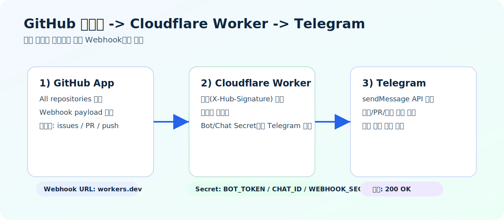
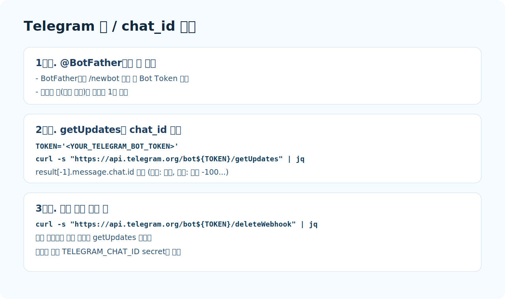
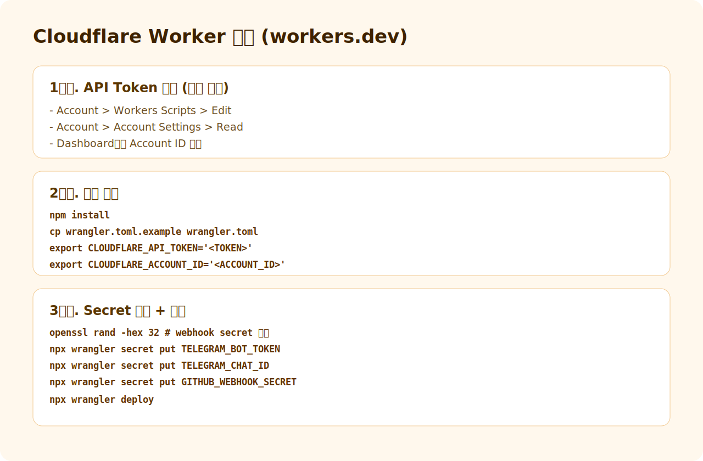
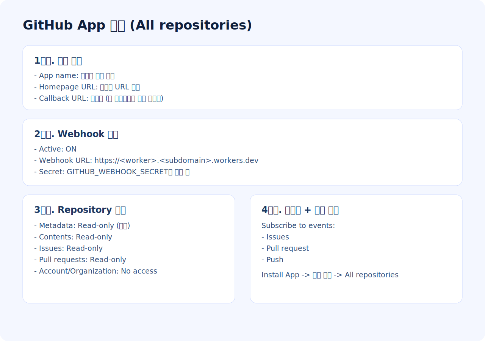
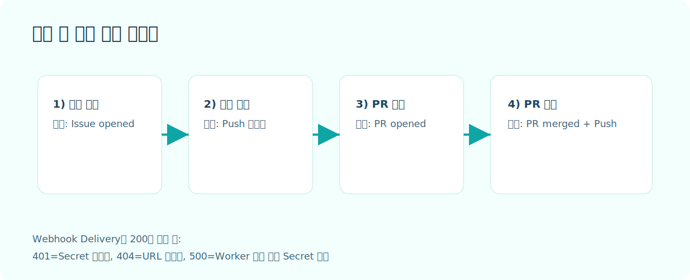

# GithubTelegramNotifier

[한국어](./README.md) | [English](./README.en.md)

GitHub App Webhook을 Cloudflare Worker로 받아 Telegram으로 전달하는 알림 브리지입니다.



## 무엇을 해주나요?
- 여러 저장소 이벤트를 단일 Webhook URL로 수집
- `issues`, `pull_request`, `push` 이벤트 알림 전송
- GitHub 서명(`X-Hub-Signature-256`) 검증
- `workers.dev` 기반 빠른 배포

## 사전 준비
- Cloudflare 계정
- GitHub 계정
- Telegram 계정
- Node.js + npm
- `jq` (권장)

## 1) Telegram 설정 (Bot Token + Chat ID)


### 1-1. 봇 생성
1. Telegram에서 `@BotFather` 검색
2. `/newbot` 실행
3. 발급된 Bot Token 복사

### 1-2. chat_id 조회
1. 생성한 봇(또는 봇이 들어간 그룹)에 메시지 1개 전송
2. 아래 명령 실행

```bash
TOKEN='<YOUR_TELEGRAM_BOT_TOKEN>'
curl -s "https://api.telegram.org/bot${TOKEN}/getUpdates" \
| jq -r '.result[-1].message.chat.id // .result[-1].my_chat_member.chat.id // .result[-1].channel_post.chat.id'
```

참고:
- 개인 채팅 ID는 보통 양수
- 그룹 채팅 ID는 보통 `-100...`

값이 안 나오면:

```bash
curl -s "https://api.telegram.org/bot${TOKEN}/deleteWebhook" | jq
```

다시 메시지를 보내고 `getUpdates`를 재실행하세요.

## 2) Cloudflare 설정 (Worker + Secret)


### 2-1. API Token 생성
Cloudflare Dashboard에서 최소 권한으로 토큰 생성:
- `Account > Workers Scripts > Edit`
- `Account > Account Settings > Read`

그리고 `Account ID`를 확인합니다.

### 2-2. 로컬 준비
```bash
npm install
cp wrangler.toml.example wrangler.toml

export CLOUDFLARE_API_TOKEN='<YOUR_CF_API_TOKEN>'
export CLOUDFLARE_ACCOUNT_ID='<YOUR_CF_ACCOUNT_ID>'
```

### 2-3. Webhook secret 생성
```bash
openssl rand -hex 32
```

생성한 값을 2곳에 동일하게 사용해야 합니다.
- Worker secret: `GITHUB_WEBHOOK_SECRET`
- GitHub App Webhook Secret 입력칸

### 2-4. Worker secret 등록 + 배포
```bash
npx wrangler secret put TELEGRAM_BOT_TOKEN
npx wrangler secret put TELEGRAM_CHAT_ID
npx wrangler secret put GITHUB_WEBHOOK_SECRET
npx wrangler deploy
```

배포 URL 예시:
- `https://<worker-name>.<subdomain>.workers.dev`

## 3) GitHub App 설정 (All repositories)


`GitHub Settings -> Developer settings -> GitHub Apps -> New GitHub App`

### 3-1. 기본 정보
- App name: 고유한 이름
- Homepage URL: 이 저장소 URL
- Callback URL: 비워둠 (이 프로젝트는 OAuth 콜백 미사용)

### 3-2. Webhook
- Active: On
- Webhook URL: Worker 배포 URL
- Secret: `GITHUB_WEBHOOK_SECRET`와 동일 값
- SSL verification: Enable

### 3-3. Repository permissions
- Metadata: Read-only (필수)
- Contents: Read-only
- Issues: Read-only
- Pull requests: Read-only
- Account/Organization permissions: No access

### 3-4. Subscribe to events
아래 3개만 체크:
- Issues
- Pull request
- Push

### 3-5. 설치 범위
앱 생성 후 `Install App`에서:
- 대상 계정 선택
- `All repositories` 선택

## 4) 알림 검증 순서


아래 순서로 테스트하면 전체 흐름을 빠르게 검증할 수 있습니다.
1. 이슈 생성
2. 커밋 푸시
3. PR 생성
4. PR 머지

정상이라면 Telegram에 이벤트별 메시지가 도착합니다.

## 5) Telegram 메시지 포맷 예시

아래 예시는 현재 Worker 기본 포맷입니다.

### 5-1. 이슈 예시
```text
🧩 <b>이슈 생성</b>
저장소: <code>pxzhu/GithubTelegramNotifier</code>
번호: <code>#42</code>
제목: README 설정 설명 보강
작성자: pxzhu
현재 상태: 열림
라벨: docs, setup
<a href="https://github.com/pxzhu/GithubTelegramNotifier/issues/42">GitHub에서 이슈 보기</a>
```

### 5-2. PR 예시
```text
🔀 <b>PR 머지 완료</b>
저장소: <code>pxzhu/GithubTelegramNotifier</code>
번호: <code>#58</code>
제목: README 이미지/설정 가이드 개선
작성자: pxzhu
브랜치: <code>readme-korean-setup → main</code>
상태: merged
Draft: 아니오
변경 규모: 커밋 4개 / 파일 7개
머지 커밋: <code>7f3a2c1</code>
<a href="https://github.com/pxzhu/GithubTelegramNotifier/pull/58">GitHub에서 PR 보기</a>
```

### 5-3. Push 예시
```text
📦 <b>푸시</b>
저장소: <code>pxzhu/GithubTelegramNotifier</code>
브랜치: <code>main</code>
푸시 사용자: pxzhu
커밋 수: <code>3</code>
커밋 목록:
1. <code>8ab12cd</code> docs: README 한글 설명 보강 <i>(pxzhu)</i>
2. <code>91de34f</code> fix: 텔레그램 메시지 포맷 개선 <i>(pxzhu)</i>
3. <code>72aa9bc</code> chore: 이미지 링크 정리 <i>(pxzhu)</i>
<a href="https://github.com/pxzhu/GithubTelegramNotifier/compare/old...new">GitHub에서 변경 비교 보기</a>
```

## 문제 해결
- Webhook `401`: Secret 불일치
- Webhook `404`: Webhook URL 오입력
- Webhook `500`: Worker 내부 오류 또는 secret 누락
- Telegram 미수신: chat_id 오류, 봇 미초대, bot token 문제

## 보안 체크리스트
- 실제 토큰/시크릿은 절대 Git에 커밋하지 않기
- 유출 시 즉시 재발급
- Cloudflare API Token은 최소 권한 유지

## 파일 안내
- `github-global-telegram-worker.js`: Worker 코드
- `wrangler.toml.example`: Wrangler 설정 템플릿
- `README.en.md`: 영문 가이드
- `docs/images/*.svg`: 설정 다이어그램

## License
MIT
